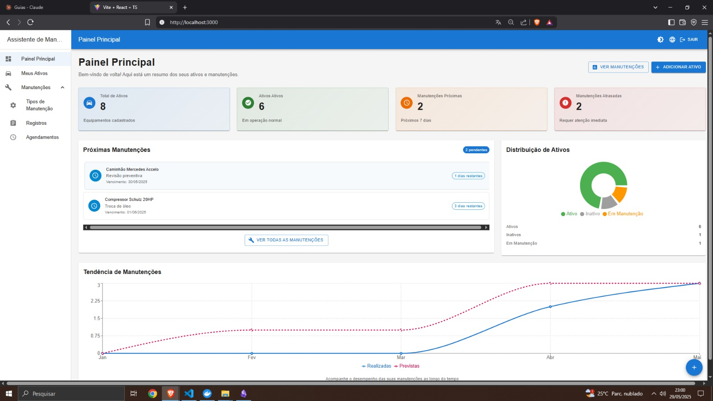
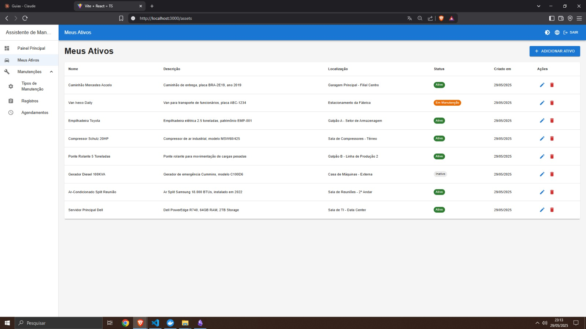
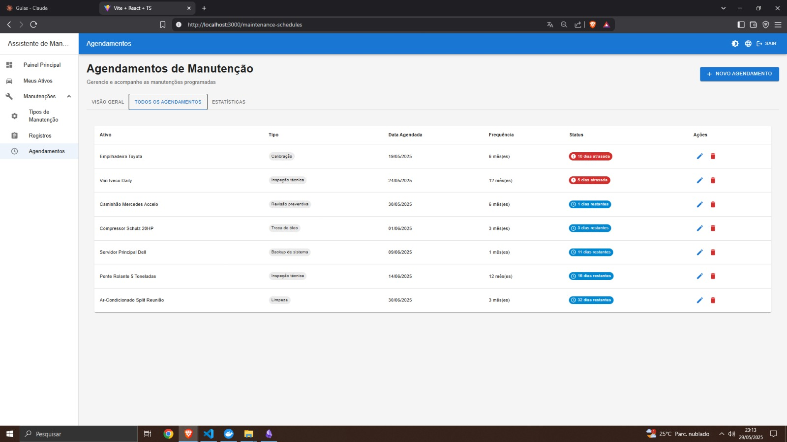

# Assistente de Manutenção de Ativos

[](https://github.com/seu-usuario/assistente-manutencao-ativos)
[](https://www.docker.com/)
[](https://www.typescriptlang.org/)

## 📜 Descrição

**Assistente de Manutenção de Ativos** é uma aplicação completa para gerenciamento inteligente de equipamentos e suas manutenções. O sistema oferece controle total sobre ativos empresariais, com agendamento automático de manutenções, alertas visuais e dashboard avançado. Nunca mais esqueça uma manutenção importante!

A plataforma utiliza arquitetura moderna com backend Node.js/Express, frontend React/TypeScript e banco PostgreSQL, oferecendo uma experiência completa e profissional para gestão de ativos.

## 🖼️ Demonstração Visual

### 📊 **Dashboard Principal**
*Visão completa do sistema com métricas, gráficos e alertas em tempo real*

<div align="center">
  
</div>

---

### 🚗 **Gestão de Ativos**
*Interface intuitiva para gerenciar equipamentos e veículos*

<div align="center">
  
</div>

---

### 🔧 **Sistema de Manutenção**
*Agendamentos inteligentes com alertas visuais por urgência*

<div align="center">
  
</div>


## ✨ Funcionalidades Principais

### 🔐 **Sistema de Autenticação Completo**
* Cadastro e Login seguro com JWT
* Recuperação de senha via email
* Sessões protegidas e tokens seguros
* Isolamento total de dados por usuário

### 🚗 **Gestão Inteligente de Ativos**
* CRUD completo de equipamentos/veículos
* Status dinâmicos: Ativo, Inativo, Em Manutenção
* Organização por localização e descrição
* Estatísticas visuais em tempo real

### 🔧 **Sistema Avançado de Manutenção**
* **Tipos de Manutenção:** Padrão do sistema + tipos customizados
* **Registros Históricos:** Controle completo de manutenções realizadas
* **Agendamentos Inteligentes:** Sistema automático de próximas manutenções
* **Frequências Flexíveis:** dias, semanas, meses, quilômetros, horas de uso

### 🤖 **Automação Inteligente**
* **Auto-agendamento:** Criação automática da próxima manutenção
* **Detecção de Atrasos:** Identificação automática de manutenções vencidas
* **Integração Transparente:** Registros marcam agendamentos como completos
* **Alertas Visuais:** Notificações por cores e urgência

### 📊 **Dashboard Profissional**
* **Cards Estatísticos:** Métricas em tempo real
* **Gráficos Interativos:** Distribuição de ativos e tendências
* **Sistema de Alertas:** Manutenções próximas e atrasadas
* **Visualização Intuitiva:** Interface moderna e responsiva

### 🌍 **Experiência Internacional**
* **Multi-idioma:** Português, Inglês e Espanhol
* **Temas Dinâmicos:** Modo claro e escuro
* **Design Responsivo:** Funciona em desktop, tablet e mobile

## 💻 Tecnologias Utilizadas

### **Backend**
* **Node.js** com **Express.js**
* **TypeScript** (100% tipado)
* **PostgreSQL** com queries nativas
* **JWT** (JSON Web Tokens) para autenticação
* **Bcrypt** para hash de senhas
* **Nodemailer** para envio de emails
* **Docker** para containerização

### **Frontend**
* **React 19** com **TypeScript**
* **Material-UI (MUI)** para interface moderna
* **React Router** para navegação SPA
* **Axios** para requisições HTTP
* **Recharts** para gráficos interativos
* **i18next** para internacionalização

### **Banco de Dados**
* **PostgreSQL** com modelagem relacional
* **Queries nativas** (sem ORM)
* **Relacionamentos complexos** entre entidades
* **Índices otimizados** para performance

### **DevOps & Ferramentas**
* **Docker & Docker Compose**
* **Scripts de inicialização automática**
* **Variáveis de ambiente configuráveis**
* **Estrutura modular e escalável**

## 🚀 Pré-requisitos

Antes de começar, certifique-se de ter instalado:

* [Node.js](https://nodejs.org/) (Versão >= 18.x)
* [npm](https://www.npmjs.com/) ou [Yarn](https://yarnpkg.com/)
* [PostgreSQL](https://www.postgresql.org/) (Versão >= 12.x)
* [Docker](https://www.docker.com/) e [Docker Compose](https://docs.docker.com/compose/) (opcional, mas recomendado)

## ⚙️ Instalação e Configuração

### 🐳 **Opção 1: Com Docker (Recomendado)**

1. **Clone o repositório:**
   ```bash
   git clone https://github.com/seu-usuario/assistente-manutencao-ativos.git
   cd assistente-manutencao-ativos
   ```

2. **Configure as variáveis de ambiente:**
   ```bash
   # Crie o arquivo .env no backend
   cp backend/.env.example backend/.env
   
   # Edite as configurações necessárias
   nano backend/.env
   ```

3. **Execute com Docker:**
   ```bash
   docker-compose up -d
   ```

4. **Inicialize o banco de dados:**
   ```bash
   docker-compose exec backend npm run setup-db
   ```

5. **Acesse a aplicação:**
   - Frontend: `http://localhost:3000`
   - Backend: `http://localhost:3001`
   - Banco: `localhost:5432`

### 🔧 **Opção 2: Instalação Manual**

1. **Clone e configure o backend:**
   ```bash
   git clone https://github.com/seu-usuario/assistente-manutencao-ativos.git
   cd assistente-manutencao-ativos/backend
   
   # Instale dependências
   npm install
   
   # Configure variáveis de ambiente
   cp .env.example .env
   nano .env
   ```

2. **Configure o banco de dados:**
   ```bash
   # Crie o banco PostgreSQL
   createdb maintenance_system
   
   # Execute as migrações
   npm run setup-db
   ```

3. **Configure o frontend:**
   ```bash
   cd ../frontend
   npm install
   
   # Configure a URL da API se necessário
   cp .env.example .env
   ```

4. **Execute os serviços:**
   ```bash
   # Terminal 1 - Backend
   cd backend
   npm run dev
   
   # Terminal 2 - Frontend  
   cd frontend
   npm run dev
   ```

## 📋 Variáveis de Ambiente

Crie um arquivo `.env` na pasta `backend` com as seguintes configurações:

```env
# Banco de Dados
DB_HOST=localhost
DB_PORT=5432
DB_USER=postgres
DB_PASSWORD=sua_senha
DB_NAME=maintenance_system

# Autenticação
JWT_SECRET=seu_jwt_secret_super_seguro
JWT_EXPIRES_IN=7d

# Email (para recuperação de senha)
SMTP_HOST=smtp.gmail.com
SMTP_PORT=587
SMTP_USER=seu_email@gmail.com
SMTP_PASS=sua_senha_app

# URLs
FRONTEND_URL=http://localhost:3000
BACKEND_URL=http://localhost:3001

# Porta do servidor
PORT=3001

# Ambiente
NODE_ENV=development
```

## ▶️ Executando a Aplicação

### **Com Docker:**
```bash
# Subir os serviços
docker-compose up -d

# Inicializar o banco de dados (primeira execução)
docker-compose exec backend npm run setup-db
```

### **Desenvolvimento:**
```bash
# Backend
cd backend && npm run dev

# Frontend  
cd frontend && npm run dev
```

### **Produção:**
```bash
# Backend
cd backend && npm run build && npm start

# Frontend
cd frontend && npm run build && npm run preview
```

## 🏗️ Estrutura do Projeto

```
assistente-manutencao-ativos/
├── backend/
│   ├── src/
│   │   ├── config/          # Configurações (DB, setup)
│   │   ├── controllers/     # Controladores das rotas
│   │   ├── middlewares/     # Middlewares (auth, etc)
│   │   ├── models/          # Modelos de dados
│   │   ├── routes/          # Definição das rotas
│   │   ├── services/        # Serviços (email, etc)
│   │   └── index.ts         # Entrada da aplicação
│   ├── Dockerfile
│   ├── package.json
│   └── tsconfig.json
├── frontend/
│   ├── src/
│   │   ├── components/      # Componentes React
│   │   ├── context/         # Context API
│   │   ├── locales/         # Arquivos de tradução
│   │   ├── pages/           # Páginas da aplicação
│   │   ├── services/        # Serviços de API
│   │   ├── theme/           # Temas Material-UI
│   │   └── types/           # Tipos TypeScript
│   ├── Dockerfile
│   ├── package.json
│   └── vite.config.ts
├── docker-compose.yml
└── README.md
```

## 🔌 Endpoints da API

### **Autenticação (`/api/auth`)**
```http
POST   /api/auth/register          # Cadastro
POST   /api/auth/login             # Login
GET    /api/auth/profile           # Perfil do usuário
POST   /api/auth/forgot-password   # Recuperar senha
POST   /api/auth/reset-password    # Redefinir senha
```

### **Ativos (`/api/assets`)**
```http
GET    /api/assets                 # Listar ativos
GET    /api/assets/stats           # Estatísticas
GET    /api/assets/:id             # Ativo específico
POST   /api/assets                 # Criar ativo
PUT    /api/assets/:id             # Atualizar ativo
DELETE /api/assets/:id             # Deletar ativo
```

### **Tipos de Manutenção (`/api/maintenance-types`)**
```http
GET    /api/maintenance-types                # Listar tipos
POST   /api/maintenance-types               # Criar tipo
POST   /api/maintenance-types/create-defaults # Criar tipos padrão
PUT    /api/maintenance-types/:id           # Atualizar tipo
DELETE /api/maintenance-types/:id           # Deletar tipo
```

### **Registros de Manutenção (`/api/maintenance-records`)**
```http
GET    /api/maintenance-records              # Listar registros
GET    /api/maintenance-records/stats        # Estatísticas
GET    /api/maintenance-records/recent       # Registros recentes
POST   /api/maintenance-records              # Criar registro
PUT    /api/maintenance-records/:id          # Atualizar registro
DELETE /api/maintenance-records/:id          # Deletar registro
```

### **Agendamentos (`/api/maintenance-schedules`)**
```http
GET    /api/maintenance-schedules            # Listar agendamentos
GET    /api/maintenance-schedules/upcoming   # Próximos agendamentos
GET    /api/maintenance-schedules/overdue    # Agendamentos atrasados
POST   /api/maintenance-schedules            # Criar agendamento
POST   /api/maintenance-schedules/:id/complete # Marcar como completo
```

## 🎯 Funcionalidades em Destaque

### **Dashboard Inteligente**
- 📊 **Métricas em Tempo Real:** Total de ativos, manutenções pendentes/atrasadas
- 📈 **Gráficos Interativos:** Distribuição de ativos e tendências de manutenção
- 🚨 **Alertas Visuais:** Sistema de cores por urgência (verde, amarelo, vermelho)
- 🔄 **Atualizações Automáticas:** Dados sempre sincronizados

### **Sistema de Agendamento Automático**
- ⚙️ **Cálculo Inteligente:** Próximas datas baseadas em frequência configurada
- 🔍 **Detecção Automática:** Identifica manutenções atrasadas automaticamente
- 🔗 **Integração Transparente:** Registros marcam agendamentos como completos
- 📅 **Frequências Flexíveis:** Suporte a dias, semanas, meses, km e horas

### **Interface Moderna**
- 🎨 **Material Design:** Interface seguindo padrões do Google
- 🌓 **Tema Claro/Escuro:** Alternância dinâmica de temas
- 📱 **Totalmente Responsivo:** Funciona perfeitamente em qualquer dispositivo
- 🌍 **Multi-idioma:** Português, Inglês e Espanhol

## 🤝 Contribuindo

1. Faça um fork do projeto
2. Crie uma branch para sua feature (`git checkout -b feature/nova-funcionalidade`)
3. Commit suas mudanças (`git commit -am 'Adiciona nova funcionalidade'`)
4. Push para a branch (`git push origin feature/nova-funcionalidade`)
5. Abra um Pull Request

## 📝 Licença

Este projeto está licenciado sob a **Licença MIT** - veja o arquivo [LICENSE](LICENSE) para detalhes.

## 📞 Suporte

Se você encontrar algum problema ou tiver dúvidas:

1. Verifique se todas as dependências estão instaladas
2. Confirme se o PostgreSQL está rodando
3. Verifique as variáveis de ambiente
4. Abra uma [issue](https://github.com/seu-usuario/assistente-manutencao-ativos/issues) no GitHub

---

**⭐ Se este projeto foi útil para você, não esqueça de dar uma estrela no repositório!**
